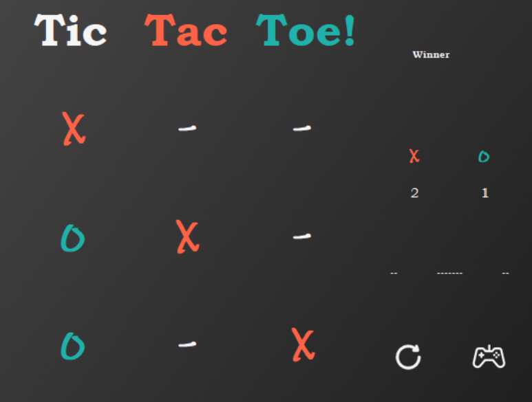

# .Net C++/CLI Tic-Tac-Toe


## Overview

<div style="width:100%; display:flex; justify-content:center;align-items:center;gap:100px;">
    
</div>

This is a Windows Form designed using the .net Framework using C++.

The Game is modelled after the classic **Tic Tac Toe** game where 2 players take turns to try and get 3 icons in a row before the other player. Wins are recorded for continuous playing and can be reset if required.

## Technologies


<div style="width:100%; display:flex; justify-content:center;align-items:center;gap:100px;">
    
     
</div>


## Setup 

Run ```Tic-Tac-Toe.exe```

## Usage

<div style="display:flex; align-items:center; padding: 0 20px;width:100%;gap: 20px; height 50px; ">
New Game button.
</div>

Press the new game button to start a new game. The board will be reset and the game will start from Player x.

This is required to start the game.

<div style="display:flex; align-items:center; padding: 0 20px;width:100%;gap: 20px; height 50px; ">
Reset Game button.
</div>

The current game will no longer be active and the win statistics will be reset for each player.

<div style="display:flex; align-items:center; padding: 0 20px;width:100%;gap: 20px; height 50px; ">
Current Players turn display
</div>

Displays the turn of the current player. This will be set to ```-------``` when the game is inactive.

<div style="display:flex; align-items:center; padding: 0 20px;width:100%;gap: 20px; height 50px; ">
Win Statistics
</div>


Displays the win statistics between Player ```x``` and Player ```o```

<div style="display:flex; align-items:center; padding: 0 20px;width:100%;gap: 20px; height 50px; ">
Header Messsage Display
</div>

Displays information relative to the game. This is located at the top of the side panel and will also contain ```Welcome```, ```Winner!``` or will not be displayed.

---
<div style="display:flex; align-items:center; padding: 0 20px;width:100%;gap: 20px; height 50px; ">
Game board
</div>


Spaces can be as follows:
- ```-``` represents a blank space
- ```x``` represents a move by Player ```x```
- ```o``` represents a move by Player ```o```

When it is the players turn they can click a ```blank space``` and that will be set with their associated icon

Once there is a line of 3 icons the game stops and a winner is declared. If no winner is decleared it is considered a draw


